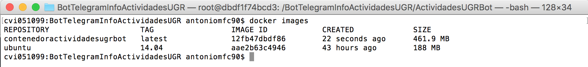
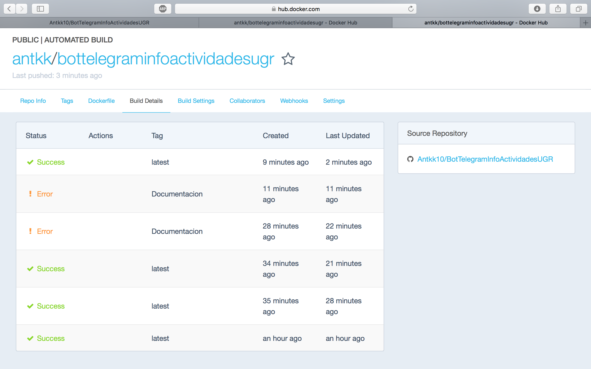
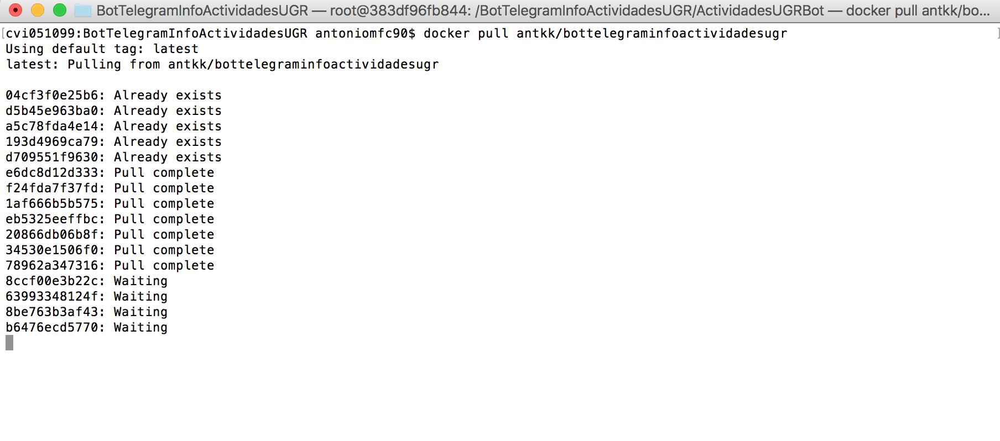
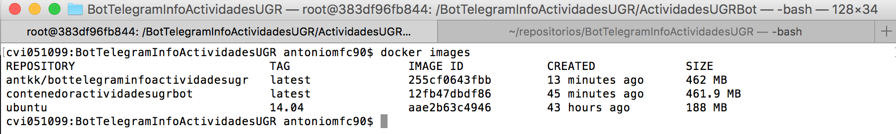

## Creación y uso de contenedores con Docker ##

Lo primero que he hecho ha sido instalar Docker en Mac [Página oficial Docker](https://www.docker.com).

Para instalar el contenedor primero debemos de crear el archivo **Dockerfile**.
El contenido de mi Dockerfile es el siguiente:

    FROM ubuntu:14.04

    MAINTAINER Antonio Manuel Fernández Cantos <antkk10@correo.ugr.es>

    # Variables de entorno para poder conectarse a la base de datos
    ARG DATABASE_URL
    ARG HOST_BD
    ARG NAME_BD
    ARG PW_BD
    ARG TOKENBOT
    ARG USER_BD

    ENV DATABASE_URL=$DATABASE_URL
    ENV HOST_BD=$HOST_BD
    ENV NAME_BD=$NAME_BD
    ENV PW_BD=$PW_BD
    ENV TOKENBOT=$TOKENBOT
    ENV USER_BD=$USER_BD

    RUN apt-get update

    # Instalamos python
    RUN apt-get install -y python-setuptools
    RUN apt-get install -y python-dev
    RUN apt-get install -y build-essential
    RUN apt-get install -y python-psycopg2
    RUN apt-get install -y libpq-dev
    RUN apt-get install -y python-pip
    RUN pip install --upgrade pip

    # Instalamos git y descargamos el repositorio
    RUN apt-get install -y git
    RUN git clone https://github.com/Antkk10/BotTelegramInfoActividadesUGR.git

    # Instalamos todo lo necesario para ejecutar el bot
    RUN cd BotTelegramInfoActividadesUGR/ && make install

Para crear el contenedor insertamos este comando y nos tenemos que situar en la carpeta donde hemos creado **Dockerfile**

    docker build -t contenedoractividadesugrbot ./

Cuando termine la instalación podemos comprobar que está instalado el contenedor con:

    docker images

Para acceder al contenedor introducimos este comando en el terminal:

    docker run -e "DATABASE_URL=XXX" -e "HOST_BD=XXXX" -e "NAME_BD=XXXX" -e "PW_BD=XXXX" -e "TOKENBOT=XXXX" -e "USER_BD=XXXX" -i -t contenedoractividadesugrbot /bin/bash

Con esta orden accedemos al contenedor, con la opción -e le damos valor a las variables de entorno que necesita mi bot para el token de Telegram y para acceder a la base de datos. Con /bin/bash indicamos que abrimos el terminal de ubuntu y **contenedoractividadesugrbot** es el nombre del contenedor que queremos acceder.

Una vez que he probado que funciona el contenedor en local, he procedido a subirlo a [Docker hub](https://hub.docker.com).
El primer paso es registrarse, después he asociado mi cuenta de github a la cuenta de docker hub. Después he hecho un push al repositorio de github para subir Dockerfile. En el repositorio de la página web comprueba que el contenedor funciona correctamente:

Nota: El Error da en la rama de Documentación ya que solo contiene archivos de texto.

Como podemos observar el contenedor del bot funciona correctamente.

Para descargar el contenedor en nuestra máquina local basta con poner:

    docker pull antkk/bottelegraminfoactividadesugr

#### Base de datos ####

Como base de datos he usado la que tengo en **Heroku** (psql). Para conectarme a ella le paso los valores de entorno con la opción -e cuando me conecto al contenedor (leer la instrucción de como conectarse al contenedor un poco más arriba en este documento).

Repositorio de docker hub [enlace](https://hub.docker.com/r/antkk/bottelegraminfoactividadesugr/)

#### Ejecutar el bot ####

Para ejecutar el bot, una vez que estamos dentro del contenedor, utilizamos este comando:

    cd BotTelegramInfoActividadesUGR/ActividadesUGRBot && python actividadesUGR_bot.py
