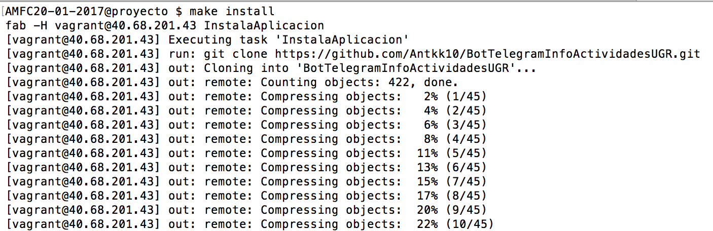
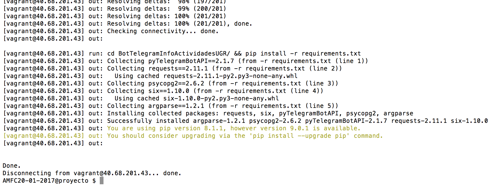

# Documentación Hito 5: Virtualización de aplicaciones. #

Lo primero que he hecho ha sido obtener una cuenta en azure con el código que me proporcionó JJ. Azure proporciona un entorno gestionado para la ejecución y el despliegue de aplicaciones y servicios en la nube. Windows Azure proporciona a los desarrolladores un entorno de computación bajo demanda y almacenamiento alojado en los centros de datos de Microsoft para aplicaciones en la web.

Después de hacer todo el proceso en la página web, procedemos a instalar las herramientas necesarias para poder desplegar nuestra máquina. He utilizado la herramienta Vagrant (Vagrant es un software que nos permite construir nuestras máquinas virtuales de una forma rápida y automática a través del concepto que denominan "box" o caja. Para que Vagrant nos funcione necesitamos tener instalado VirtualBox.) para el despliegue de la máquina. El primer paso es instalarlo con Virtualbox

    sudo apt update
    sudo apt install -y virtualbox

Seguimos con Vagrant y el plugin de azure para vagrant ([instalación del plugin](https://github.com/Azure/vagrant-azure)) para el propio Vagrant:

    sudo apt install -y vagrant
    vagrant plugin install vagrant-azure --plugin-version '2.0.0.pre1'

Para poder lanzar el despliegue con vagrant es necesario crear el archivo Vagrantfile, en el cual indicamos todo lo necesario para que se despliegue como quiero la máquina virtual. El contenido de[Vagrantfile](https://github.com/Antkk10/BotTelegramInfoActividadesUGR/blob/master/Vagrantfile) es el siguiente:

    Vagrant.configure('2') do |config|
      config.vm.box = 'azure' # Indicamos donde estará la caja
      config.vm.box_url = 'https://github.com/msopentech/vagrant-azure/raw/master/dummy.box' # Caja vacía
      config.vm.hostname = 'localhost'
      config.vm.network "public_network"
      config.vm.network "private_network",ip: "192.168.50.4", virtualbox__intnet: "vboxnet0" #Ip privada
      config.vm.network "forwarded_port", guest: 80, host: 80 # puerto de escucha.
      # ssh
      config.ssh.username = 'vagrant'
      config.ssh.private_key_path = File.expand_path('~/.ssh/id_rsa')

      config.vm.provider :azure do |azure|
        # Indicamos el SO en azure.
        azure.vm_image_urn = 'canonical:ubuntuserver:16.04.0-LTS:16.04.201606270'
        azure.location = 'westeurope' # Localización
        azure.vm_name = 'BotActividadesUGR'
        azure.vm_size = 'Standard_A0'
        azure.tcp_endpoints = '80:80'
        azure.vm_password = 'pass'

        # each of the below values will default to use the env vars named as below if not specified explicitly
        azure.tenant_id = ENV['TENANT_AZURE']
        azure.client_id = ENV['CLIENT_AZURE']
        azure.client_secret = ENV['CLIENT_SECRET_AZURE']
        azure.subscription_id = ENV['SUBSCRIPTION_AZURE']
      end

      #Provisionamiento
      config.vm.provision "ansible" do |ansible|
            ansible.sudo = true
            ansible.playbook = "playbock.yml"
            ansible.verbose = "v"
            ansible.host_key_checking = false
      end
    end

Antes de realizar el despliegue, necesitamos obtener una serie de claves (tenant_id, client_id, client_secret, subscription_id), seguimos este [tutorial](https://www.terraform.io/docs/providers/azurerm/).

Para instalar todos los paquetes necesarios en la máquina virtual, usamos **Ansible**(Es una herramienta que nos permite gestionar configuraciones, aprovisionamiento de recursos, despliegue automático de aplicaciones y muchas otras tareas de TI de una forma limpia y sencilla). Como podemos observar en el archivo **Vagrantfile**, en el apartado de ansible, vemos que se llama a un archivo [playbock.yml](https://github.com/Antkk10/BotTelegramInfoActividadesUGR/blob/master/playbock.yml), que es donde están definidos todos los paquetes que queremos que se instalen en nuestra máquina virtual remota. El contenido del archivo es el siguiente:

    - hosts: all
      sudo: yes
      remote_user: vagrant
      vars:
        TOKENBOT: "{{ lookup('env','TOKENBOT') }}"
        HOST_BD: "{{ lookup('env', 'HOST_BD') }}"
        USER_BD: "{{ lookup('env','USER_BD') }}"
        PW_BD: "{{ lookup('env', 'PW_BD') }}"
        NAME_BD: "{{ lookup('env', 'NAME_BD') }}"
      tasks:
      - name: Actualizar
        command: sudo apt-get update
      - name: Instalar setuptools python
        apt: name=python-setuptools state=present
      - name: Instalar python-dev
        apt: name=python-dev state=present
      - name: Instalar libpq-dev python
        apt: name=libpq-dev state=present
      - name: Instalar build-essential python
        apt: name=build-essential state=present
      - name: Instalar python-psycopg2
        apt: name=python-psycopg2 state=present
      - name: Instalar git
        apt: name=git state=present
      - name: Instalar pip
        apt: name=python-pip state=present
      - name: Instalamos la API del bot
        command: sudo pip install python-telegram-bot
      - name: Instalar supervisor
        apt: name=supervisor state=present
      - name: Configura programa para supervisor
        template: src=supervisorbot.conf dest=/etc/supervisor/conf.d/supervisorbot.conf
      - name: Ejecutar supervisor
        service: name=supervisor state=started
      - name: Instala postgresql
        apt: name=postgresql state=present
        apt: name=postgresql-contrib state=present

Una vez que tenemos todo lo explicado anteriormente, procedemos al despliegue usando el [makefile](https://github.com/Antkk10/BotTelegramInfoActividadesUGR/blob/master/makefile). Con la orden

    make despliegue.

Desplegamos la máquina virtual. La orden despliegue realmente lo que está haciendo es:

    vagrant up --provider=azure

Además de desplegar la máquina, realiza automáticamente el aprovisionamiento (llamada automática a ansible). No es necesario utilizar el comando:

    vagrant provision.

El aprovisionamiento de la máquina virtual la podemos hacer siempre que queramos sin necesidad de destruirla. Usamos

    make provision

para realizar el aprovisionamiento. Esta orden se traduce en

    vagrant provision

Cuando se estaba realizando el aprovisionamiento, he tenido un error. Esto se soluciona creando el archivo [ansible.cfg](https://github.com/Antkk10/BotTelegramInfoActividadesUGR/blob/master/ansible.cfg) con este contenido:

    [defaults]
    host_key_checking = False
    [ssh_connection]
    control_path=%(directory)s/%%h-%%r

Una vez que tenemos la máquina desplegada y aprovisionada, utilizamos fabric (permite empaquetar, implementar y administrar microservicios escalables y confiables) para instalar, ejecutar, realizar test y parar la ejecución.
Para [instalar](http://www.fabfile.org/installing.html) fabric insertamos este comando:

    sudo pip install fabric

Una vez que tenemos instalado fabric, vamos a utilizar su funcionalidad para realizar las acciones comentadas anteriormente, pero antes vamos a ver el contenido del archivo fabfile.py que es el que usa esta herramienta:

    # coding: utf-8

    from fabric.api import sudo, cd, env, run, shell_env
    import os

    def InstalaAplicacion():
        """ Función para descargar el bot del repositorio. """

        # Descargamos la app
        run('git clone https://github.com/Antkk10/BotTelegramInfoActividadesUGR.git')

        # Accedemos y terminamos de instalar los requisitos
        run('cd BotTelegramInfoActividadesUGR/ && pip install -r requirements.txt')

    def EjecutarApp():
        """ Función para ejecutar el Bot. """
        with shell_env(HOST_BD=os.environ['HOST_BD'],
                        USER_BD=os.environ['USER_BD'],
                        PW_BD=os.environ['PW_BD'],
                        NAME_BD=os.environ['NAME_BD'],
                        TOKENBOT=os.environ['TOKENBOT']
                        ):
            run('sudo supervisorctl start botactividades')

    def StopApp():
        """ Función que para el bot. """
        run('sudo supervisorctl stop botactividades')

    def TestApp():
        """ Función para realizar test. """
        with shell_env(HOST_BD=os.environ['HOST_BD'],
                        USER_BD=os.environ['USER_BD'],
                        PW_BD=os.environ['PW_BD'],
                        NAME_BD=os.environ['NAME_BD'],
                        TOKENBOT=os.environ['TOKENBOT']
                        ):
            run('cd BotTelegramInfoActividadesUGR/ActividadesUGRBot && python test.py')

Lo primero que queremos hacer es instalar la aplicación, esto lo haremos con

    make install

la orden de la etiqueta install sería:

    fab -H vagrant@40.68.201.43 InstalaAplicacion

Resultado:

