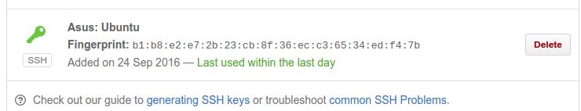

# Explicación de las acciones realizadas para la puesta a punto del desarrollo del proyecto para la asignatura IV #

### Prerrequisitos ###

Como puede comprobar el profesor, estoy en la lista de correo electrónico en Google Drive, y he rellenado la hoja haciendo corresponde mi nombre con mi usuario de Github.

También he cumplido con la lista de objetivos de la primera sesión.

### Creación de par de claves y subida de clave a Github ###

He creado mi par de claves ssh a través del terminal con el comando ssh-keygen. La clave pública que tengo que he subido a Github está en ~/.ssh/id_rsa.pub y como podemos comprobar en la siguiente imagen, tengo la clave pública subida a github.

