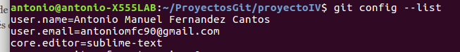
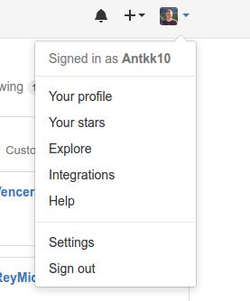
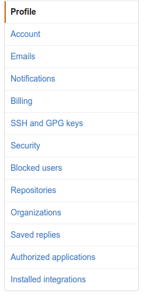
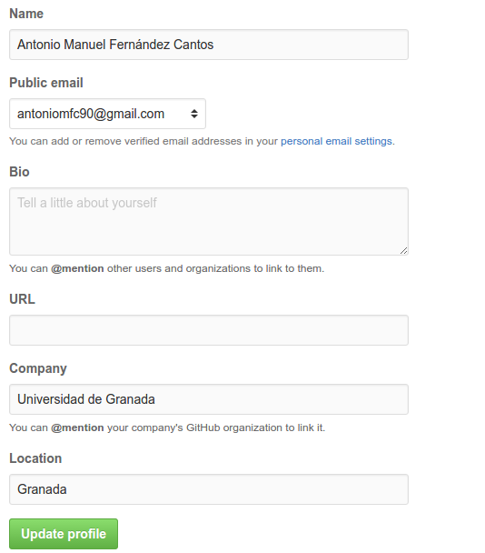

# Explicación de las acciones realizadas para la puesta a punto del desarrollo del proyecto para la asignatura IV #

### Prerrequisitos ###

Como puede comprobar el profesor, estoy en la lista de correo electrónico en Google Drive, y he rellenado la hoja haciendo corresponde mi nombre con mi usuario de Github.

También he cumplido con la lista de objetivos de la primera sesión.

### Creación de par de claves y subida de clave a Github ###

He creado mi par de claves ssh a través del terminal con el comando ssh-keygen. La clave pública que tengo que he subido a Github está en ~/.ssh/id_rsa.pub y como podemos comprobar en la siguiente imagen, tengo la clave pública subida a github.

### Configuración correcta del nombre y correo electrónico. ###

Cuando instalé git en el ordenador lo primero que hice fué guardar mi nombre y mi correo electrónico. Para almacenar en git el nombre de usuario lo hacemos con el siguiente comando:

**git config --global user.name "Antonio Manuel Fernández Cantos"**

Para almacenar el correo electrónico lo hacemos con el siguiente comando:

**git config --global user.email "antoniomfc90@gmail.com"**

Introduciendo en la consola este comando **git config --list** podemos comprobar que el nombre y email han sido almacenados:

### Edición del perfil ###

Para editar el perfil en Github accedemos a nuestra cuenta en la esquina superior derecha y pulsamos **Settings**:

En la pestaña **Profile** tenemos que rellenar los siguientes campos:
1. Name
2. Company
3. Location

Una vez rellenado los campos pulsamos el botón Update profile para confirmar los datos. Seguidos estos pasos, mi perfil tiene el siguiente aspecto:

