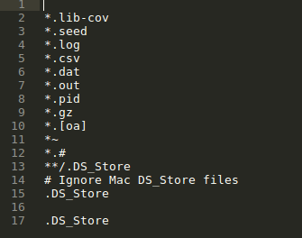

# Explicación de las acciones realizadas para la puesta a punto del desarrollo del proyecto para la asignatura IV #

### Prerrequisitos ###

Como puede comprobar el profesor, estoy en la lista de correo electrónico en Google Drive, y he rellenado la hoja haciendo corresponde mi nombre con mi usuario de Github.

También he cumplido con la lista de objetivos de la primera sesión.

### Creación de par de claves y subida de clave a Github ###

He creado mi par de claves ssh a través del terminal con el comando ssh-keygen. La clave pública que tengo que he subido a Github está en ~/.ssh/id_rsa.pub y como podemos comprobar en la siguiente imagen, tengo la clave pública subida a github.

### Configuración correcta del nombre y correo electrónico. ###

Cuando instalé git en el ordenador lo primero que hice fué guardar mi nombre y mi correo electrónico. Para almacenar en git el nombre de usuario lo hacemos con el siguiente comando:

**git config --global user.name "Antonio Manuel Fernández Cantos"**

Para almacenar el correo electrónico lo hacemos con el siguiente comando:

**git config --global user.email "antoniomfc90@gmail.com"**

Introduciendo en la consola este comando **git config --list** podemos comprobar que el nombre y email han sido almacenados:

### Edición del perfil ###

Para editar el perfil en Github accedemos a nuestra cuenta en la esquina superior derecha y pulsamos **Settings**:

En la pestaña **Profile** tenemos que rellenar los siguientes campos:

1. Name
2. Company
3. Location

Una vez rellenado los campos pulsamos el botón Update profile para confirmar los datos. Seguidos estos pasos, mi perfil tiene el siguiente aspecto:

### Creación del proyecto ###

Para crear el proyecto lo he hecho desde la página de github pulsando dentro de mis repositorios en el botón new (antes de la explicación ya había creado el proyecto).

Posteriormente rellenamos el nombre del repositorio **ProyectoIV**, inicializamos un README que posteriormente vamos a rellenar explicando en que consiste el repositorio y por último añadimos la licencia **GNU General Public License v3.0**. El archivo .gitignore lo subí de forma manual.

Pulsamos el boton create repository y ya tenemos el repositorio creado.

### Trabajar con el repositorio en el ordenador personal ###

Para descargar el contenido del repositorio almacenado en github basta con situar en la carpeta que deseamos almacenar el repositorio y insertar el siguiente comando: **git clone git@github.com:Antkk10/proyectoIV.git**. Se nos creara una carpeta llamada proyectoIV, en ella tenemos todo el contenido del proyecto y ya podremos trabajar sobre el.

### Subida de archivos, ejemplo con .gitignore ###

Para la subida de ficheros (en este caso .gitignore) abrimos un archivo nuevo **sublime-text .gitignore.md** que contiene las siguientes lineas:

Para la subida del archivo debemos meter los siguientes tres comandos que se muestran en la captura

